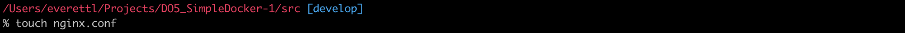

# Simple Docker

## Part 1. Готовый докер

##### Возьми официальный докер-образ с **nginx** и выкачай его при помощи `docker pull`.

1. Выкачал докер-образ с **nginx** при помощи `docker pull nginx`

##### Проверь наличие докер-образа через `docker images`.

2. Проверил наличие докер-образа командой `docker images`

##### Запусти докер-образ через `docker run -d [image_id|repository]`.

3. Запусти докер-образ командой `docker run -d 92b11f67642b`

> -d: это флаг, указывающий на запуск контейнера в фоновом режиме (detached mode). Это означает, что контейнер будет работать в фоновом режиме, и командная строка будет освобождена для дальнейшего использования.

##### Проверь, что образ запустился через `docker ps`.

4. Проверил запуск командой `docker ps`

> команда docker ps выводит только запущенные контейнеры. Но кроме них могут быть и остановленные.
При запуске команды docker ps без дополнительных флагов будут отображены только запущенные контейнеры в текущий момент времени.

##### Посмотри информацию о контейнере через `docker inspect [container_id|container_name]`.

5. Вывел командой `docker inspect` и посмотрел информацию о контейнере

##### По выводу команды определи и помести в отчёт размер контейнера, список замапленных портов и ip контейнера.

6. Определил и поместил:

Размер контейнера:

Список замапленных портов:

IP контейнера:

##### Останови докер образ через `docker stop [container_id|container_name]`.
##### Проверь, что образ остановился через `docker ps`.

7. Остановил докер образ командой `docker stop fa3c4afe7904` и проверил остановку командой `docker ps`

##### Запусти докер с портами 80 и 443 в контейнере, замапленными на такие же порты на локальной машине, через команду *run*.

8. Запустил докер с портами 80 и 443 в контейнере командой `docker run -d -p 80:80 -p 443:433 nginx`

##### Проверь, что в браузере по адресу *localhost:80* доступна стартовая страница **nginx**.

9. Проверил в браузере по адресу *localhost:80* доступ к стартовой странице nginx

##### Перезапусти докер контейнер через `docker restart [container_id|container_name]`.
##### Проверь любым способом, что контейнер запустился.

10. Перезапустил командой `docker restart unruffled_mendel` и проверил запуск `docker ps`

## Part 2. Операции с контейнером

##### Прочитай конфигурационный файл *nginx.conf* внутри докер контейнера через команду *exec*.

1. Прочитал командой `docker exec pensive_hopper cat /etc/nginx/nginx.conf`

##### Создай на локальной машине файл *nginx.conf*.

2. Создал локальный файл nginx.conf `touch nginx.conf`

##### Настрой в нем по пути */status* отдачу страницы статуса сервера **nginx**.

3. Настроил по пути */status* отдачу страницы статуса сервера

##### Скопируй созданный файл *nginx.conf* внутрь докер-образа через команду `docker cp`.

4. Скопировал созданный файл внутрь докер-образа командой `docker cp nginx.conf pensive_hopper:/etc/nginx`

##### Перезапусти **nginx** внутри докер-образа через команду *exec*.

5. Перезапустил nginx командой `docker exec pensive_hopper nginx -s reload`

##### Проверь, что по адресу *localhost:80/status* отдается страничка со статусом сервера **nginx**.

6. Проверил адрес localhost:80/status комнадой `docker exec pensive_hopper curl localhost:80/status`

##### Экспортируй контейнер в файл *container.tar* через команду *export*.
##### Останови контейнер.

7. Экспортировал `docker export pensive_hopper > container.tar` и остановил `docker stop pensive_hopper`

##### Удали образ через `docker rmi [image_id|repository]`, не удаляя перед этим контейнеры.

8. Удалил образ командой `docker rmi -f nginx`

> -f - опция "force", которая принудительно удаляет образ, даже если он используется запущенными контейнерами

##### Удали остановленный контейнер.

9. Удалил контейнер командой `docker rm unruffled_mendel`

##### Импортируй контейнер обратно через команду *import*.

10. Импортировал контейнер обратно командой `docker image import -c 'CMD ["nginx", "-g", "daemon off;"]' -c 'ENTRYPOINT ["/docker-entrypoint.sh"]' container.tar nginx`

> опция -c используется для задания команды запуска образа при его выполнении. В данном случае, задана команда CMD ["nginx", "-g", "daemon off;"], которая запустит контейнер с использованием Nginx и опцией -g для указания глобальных директив Nginx. Фраза daemon off; отключает режим демона Nginx, позволяя процессу остаться в переднем плане, а не перейти в фоновый режим.

> -c 'ENTRYPOINT ["/docker-entrypoint.sh"]': опция -c также используется для задания точки входа (entrypoint) образа. 

##### Запусти импортированный контейнер.

11. Запустил импортированный контейнер командой `docker run -d -p 80:80 -p 443:433 13ecad994002`

##### Проверь, что по адресу *localhost:80/status* отдается страничка со статусом сервера **nginx**.

12. Проверил отдачу страницы со статусом сервера nginx

## Part 3. Мини веб-сервер

##### Напиши мини-сервер на **C** и **FastCgi**, который будет возвращать простейшую страничку с надписью `Hello World!`.

1. Написал мини-сервер на C и FastCgi

> функция FCGI_Accept() принимает FastCGI-запрос и возвращает значение, указывающее успешность его выполнения. При успешном выполнении запроса выполняется блок кода внутри цикла.

> внутри цикла выводится HTTP-заголовок, указывающий, что содержимое является текстом HTML (Content-type: text/html) и статус ответа (Status: 200 OK). Затем выводится сам контент ответа (Hello World!).

##### Запусти написанный мини-сервер через *spawn-fcgi* на порту 8080.

2. Запустил контейнер с образом Nginx и привязал порт 81 на хостовой машине к порту 81 внутри контейнеракомандой `docker run -d -p 81:81 nginx`. Далее скопировал созданный файл nginx.conf и мини-сервер в докер контейнер командой `docker cp nginx.conf gallant_khorana:/etc/nginx/` и `docker cp server.c gallant_khorana:/home` и зашел в его терминал `docker exec -it gallant_khorana bash`.

> -d - опция "detach", которая запускает контейнер в фоновом режиме

> -p 81:81 - опция "publish", которая привязывает порт 81 на хостовой машине к порту 81 в контейнере
apt

3. Установил необходимое ПО командами `apt-get update` и `apt-get install -y gcc spawn-fcgi libfcgi-dev`

> spawn-fcgi - пакет, содержащий инструмент для запуска FastCGI-программ

> libfcgi-dev - пакет, содержащий заголовочные файлы и библиотеку FastCGI для разработки

> -y - c данной опцией на все вопросы автоматически предоставляется ответ Yes. Это полезно при автоматической установке пакетов в скриптах или в среде контейнеров, где интерактивное взаимодействие с пользователем невозможно.

> spawn-fcgi используется для запуска удаленных и локальных FastCGI процессов.

4. Скомпилировал `gcc -o server server.c -lfcgi` и запустил мини-сервер через spawn-fcgi на порту 8080 `spawn-fcgi -p 8080 ./server`. Далее перезагрузил командой `nginx -s reload`

> -lfcgi - опция "link", указывает, что программа должна быть связана с библиотекой libfcgi

##### Напиши свой *nginx.conf*, который будет проксировать все запросы с 81 порта на *127.0.0.1:8080*.

5. Написал свой nginx.conf

##### Проверь, что в браузере по *localhost:81* отдается написанная тобой страничка.

6. Проверил веб-страницу в браузере

##### Положи файл *nginx.conf* по пути *./nginx/nginx.conf* (это понадобится позже).

7. Положил файл по пути etc/nginx/nginx.conf командой `docker cp nginx.conf gallant_khorana:/etc/nginx/nginx.conf`

## Part 4. Свой докер

*При написании докер-образа избегай множественных вызовов команд RUN*

#### Напиши свой докер-образ, который:
##### 1) собирает исходники мини сервера на FastCgi из [Части 3](#part-3-мини-веб-сервер);
##### 2) запускает его на 8080 порту;
##### 3) копирует внутрь образа написанный *./nginx/nginx.conf*;
##### 4) запускает **nginx**.
_**nginx** можно установить внутрь докера самостоятельно, а можно воспользоваться готовым образом с **nginx**'ом, как базовым._

1. Написал свой докер-образ:

> FROM задает образ, чья файловая система берется за основу.

> WORKDIR задает рабочий каталог, относительно которого выполняются все действия во время формирования образа и при входе в контейнер.

> ADD добавляет файлы/папки из текущего окружения в образ. Если в качестве копируемого файла указать архив, то он будет добавлен в образ в распакованном виде. Также в качестве источника принимает URL.

> COPY копирует файлы и директории с хост-машины внутрь Docker-образа.

> RUN выполняет переданную строчку в терминале от пользователя root. С ее помощью вносятся основные изменения в файловую систему, добавляются пакеты, ставятся зависимости и так далее.

> CMD задает команду, которая выполняется при запуске контейнера по умолчанию. Она используется только в том случае, если контейнер был запущен без указания команды.

#### Используется CMD
docker run -it hexlet/docker-fastify-example # npm start

#### CMD не используется, так как явно указан bash
docker run -it hexlet/docker-fastify-example bash

> ENTRYPOINT указывает команду, которой будет передаваться параметр при запуске контейнера.

> EXPOSE Указывает, какой порт должно использовать приложение внутри контейнера.

> /bin/bash запускает интерактивный режим командной оболочки Bash. 

##### Собери написанный докер-образ через `docker build` при этом указав имя и тег.

2. Собрал докер-образ командой `docker build -t stoic_banzai:1.0 .`

> .(точка) означает текущий рабочий каталог контейнера, который был установлен ранее с помощью инструкции WORKDIR. Файл server.c будет скопирован в этот каталог.

##### Проверь через `docker images`, что все собралось корректно.

3. Проверил сборку командой `docker images`

##### Запусти собранный докер-образ с маппингом 81 порта на 80 на локальной машине и маппингом папки *./nginx* внутрь контейнера по адресу, где лежат конфигурационные файлы **nginx**'а (см. [Часть 2](#part-2-операции-с-контейнером)).

4. Запустил командой `docker run -it -p 80:81 -v /Users/everettl/Projects/DO5_SimpleDocker-1/src/part4_mydocker/nginx.conf:/etc/nginx/nginx.conf -d stoic_banzai:1.0 bash`

> -p 80:81 - маппинг портов. Порт 80 на локальной машине будет проксироваться на порт 81 внутри контейнера.

> -v в команде Docker используется для создания маппинга томов (volumes). Он позволяет связывать директории или файлы на вашем хосте с директориями внутри контейнера.

> -d: Запускает контейнер в фоновом режиме (daemon mode).

##### Проверь, что по localhost:80 доступна страничка написанного мини сервера.

5. Проверил доступ localhost:80

##### Допиши в *./nginx/nginx.conf* проксирование странички */status*, по которой надо отдавать статус сервера **nginx**.

6. Дописал проксирование странички /status

##### Перезапусти докер-образ.
*Если всё сделано верно, то, после сохранения файла и перезапуска контейнера, конфигурационный файл внутри докер-образа должен обновиться самостоятельно без лишних действий*
##### Проверь, что теперь по *localhost:80/status* отдается страничка со статусом **nginx**

7. Перезапустил командами `docker exec -it angry_hofstadter /bin/bash` и `nginx -s reload` и проверил localhost:80/status

## Part 5. **Dockle**

После написания образа никогда не будет лишним проверить его на безопасность.

**== Задание ==**

##### Просканируй образ из предыдущего задания через `dockle [image_id|repository]`.

1. Просканировал образ командой `dockle festive_moser:1.0`

##### Исправь образ так, чтобы при проверке через **dockle** не было ошибок и предупреждений.

2. Исправил конфигурационные файлы docker-образа так, чтобы при проверке через утилиту dockle не возникало ошибок и предупреждений (для Part5 я создал отдельный контейнер с тэгом part5, куда подгрузил измененные конфиги).

## Part 6. Базовый **Docker Compose**

Вот ты и закончил свою разминку. А хотя погоди...
Почему бы не поэкспериментировать с развёртыванием проекта, состоящего сразу из нескольких докер-образов?

**== Задание ==**

##### Напиши файл *docker-compose.yml*, с помощью которого:
##### 1) Подними докер-контейнер из [Части 5](#part-5-инструмент-dockle) _(он должен работать в локальной сети, т.е. не нужно использовать инструкцию **EXPOSE** и мапить порты на локальную машину)_.

##### 2) Подними докер-контейнер с **nginx**, который будет проксировать все запросы с 8080 порта на 81 порт первого контейнера.

1. Поднял докер-контейнер с nginx

##### Замапь 8080 порт второго контейнера на 80 порт локальной машины.

2. Замапил 8080 порт второго контейнера на 80 порт локальной машины.

##### Останови все запущенные контейнеры.

3. Остановил все запущенные контейнеры командой `docker stop`

##### Собери и запусти проект с помощью команд `docker-compose build` и `docker-compose up`.

4. Собери и запусти проект с помощью команд `docker-compose build` и `docker-compose up -d` 

> флаг -d означает "в фоновом режиме" (detached mode), что позволяет вам запустить контейнеры в фоне, без блокировки вашего терминала.

> chown -R nginx:nginx /etc/nginx/nginx.conf; Эта команда изменяет владельца и группу файла конфигурации Nginx на nginx, чтобы пользователь nginx имел право на его чтение и запись.

##### Проверь, что в браузере по *localhost:80* отдается написанная тобой страничка, как и ранее.

5. Проверил localhost:80

